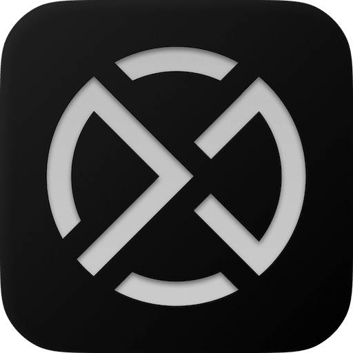

<p align="center">
  
</p>

<h1 align="center">Attyx</h1>

<p align="center">
  <strong>GPU-accelerated terminal emulator written in Zig</strong>
</p>

<p align="center">
  <a href="https://github.com/semos-labs/attyx/actions/workflows/test.yml"></a>
  
  
</p>

---

## Features

- **GPU-rendered** — Metal on macOS, OpenGL 3.3 on Linux
- **VT-compatible** — deterministic state machine core, 197 headless tests
- **Fast** — non-blocking PTY I/O, 60 fps rendering, zero per-character allocations
- **Configurable** — TOML config with hot-reload (Ctrl+Shift+R or SIGUSR1)
- **Transparent backgrounds** — window opacity + blur (macOS compositor, Linux compositor-dependent)
- **Theming** — built-in themes + custom TOML color schemes
- **Font fallback** — primary font + ordered fallback chain for symbols and emoji
- **Search** — incremental in-terminal search (Ctrl+F)
- **Scrollback** — configurable buffer with mouse wheel and keyboard navigation
- **IME** — CJK composition input on macOS
- **Cross-platform** — macOS and Linux from a single codebase

---

## Install

Requires **Zig 0.15.2+**.

```bash
zig build run           # build and launch
```

**Linux prerequisites:**

```bash
sudo apt install libglfw3-dev libfreetype-dev libfontconfig-dev libgl-dev
```

---

## Configuration

Config file: `~/.config/attyx/attyx.toml`

See [`config/attyx.toml.example`](config/attyx.toml.example) for all options with defaults.

```toml
[font]
family = "JetBrains Mono"
size = 14
cell_width = "110%"
cell_height = 20
fallback = ["Symbols Nerd Font Mono", "Noto Color Emoji"]

[cursor]
shape = "block"        # "block" | "beam" | "underline"
blink = true

[scrollback]
lines = 20000

[background]
opacity = 0.9          # 0.0–1.0
blur = 30              # macOS compositor blur radius

[window]
decorations = true     # hide title bar when false
padding = 8            # padding around the grid (px)

[theme]
name = "catppuccin-mocha"

[program]
shell = "/bin/zsh"
args = ["-l"]
```

### Hot-reload

Press **Ctrl+Shift+R** or send `SIGUSR1` to reload config without restarting. Font, cursor, scrollback, and theme changes apply immediately. Background opacity/blur require a restart.

### CLI flags

All config options can be overridden from the command line. Run `attyx --help` for the full list.

```bash
attyx --font-size 16 --theme catppuccin-mocha --background-opacity 0.85
```

---

## Themes

Attyx ships with built-in themes and supports custom TOML theme files.

**Built-in:** `default`, `catppuccin-mocha`

Set the theme in your config:

```toml
[theme]
name = "catppuccin-mocha"
```

Custom themes follow the same TOML format — define `[colors]` (foreground, background, cursor) and `[palette]` (ANSI 0–15). See `themes/default.toml` for the full structure.

---

## License

MIT
